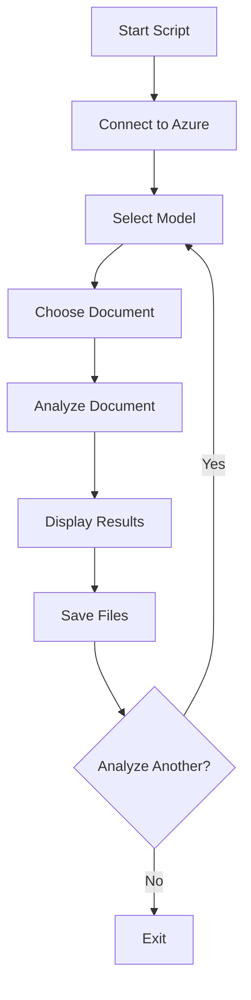

# Smart Document Analyzer

A Python script for analyzing documents using Azure AI Document Intelligence service. Extract structured information including text fields, tables, and confidence scores from various document types with support for multiple prebuilt models.

## Features

- **Multi-Model Support:** Choose from 3 prebuilt models (Document, Layout, Invoice)
- **Batch Processing:** Analyze multiple documents in one session
- **Secure Configuration:** Environment variables via .env files
- **Multiple Output Formats:** Raw text files and structured JSON
- **Confidence Scoring:** Reliability metrics for extracted data
- **Table Extraction:** Complex table detection with row/column positioning
- **Field Detection:** Key-value pair extraction with confidence levels

## Demo Video

https://github.com/user-attachments/assets/07173506-5a42-49e6-a68c-5764c63224f2

## Flowchart



## Installation

### Prerequisites
- Python 3.7+
- Azure Document Intelligence resource
- Active Azure subscription

### Install Dependencies
```bash
pip install azure-ai-formrecognizer azure-core python-dotenv
```

## Configuration

### Environment Setup
Create a .env file in your project root:
```bash
DOC_INTELLIGENCE_ENDPOINT=https://your-resource.cognitiveservices.azure.com/
DOC_INTELLIGENCE_KEY=your-actual-api-key-here
```

### Azure Resource
1. Create Document Intelligence resource in Azure Portal
2. Copy the endpoint URL and API key
3. Add credentials to your .env file

### Usage
Basic Usage

```bash
python main.py
```

## Models Guide

### Model 1: prebuilt-document

**Best for:**
- General documents, contracts, reports, unknown document types
- Basic text extraction and key-value pairs
- Simple document structure analysis
- Default choice for most documents

### Model 2: prebuilt-layout

**Best for:**
- Complex tables, multi-column layouts, financial reports
- Advanced table extraction with precise positioning
- Document structure preservation
- Multi-column text with reading order

### Model 3: prebuilt-invoice

**Best for:**
- Invoices, bills, receipts, purchase orders
- Specialized field extraction (vendor info, totals, dates)
- Line item detection
- Financial document automation

**Quick Selection Guide:**

| Model | Use Case | Key Strength |
|-------|----------|-------------|
| `prebuilt-document` | General purpose | Simple, reliable text extraction |
| `prebuilt-layout` | Complex layouts | Table and structure preservation |
| `prebuilt-invoice` | Financial docs | Specialized field recognition |

**Pro tip:** Start with `prebuilt-document` for unknown document types, then switch to specialized models if you need advanced features like precise table extraction or invoice-specific fields.

## Output Examples

### Console Display
```
RESULTS
========================================
Document: sample_invoice.pdf
Model Used: prebuilt-invoice

EXTRACTED FIELDS
========================================
• InvoiceId: INV-2024-001 (Confidence: 95.2%)
• VendorName: Acme Corporation (Confidence: 89.7%)
• InvoiceTotal: $1,250.00 (Confidence: 97.1%)

TABLE DATA
========================================
Table 1:
Dimensions: 4 rows × 3 columns
Row 0: Description | Quantity | Amount
Row 1: Widget A | 5 | $50.00
Row 2: Widget B | 3 | $75.00
Row 3: Service Fee | 1 | $25.00
```

### Output Files
#### Text File:
- **Filename**: `extracted_filename_20250801_230701.txt`
- **Content**: Clean document content
- **Purpose**: Plain text extraction from processed document
- **Format**: UTF-8 text file

#### JSON File:
- **Filename**: `analysis_filename_20250801_230701.json`
- **Content**: Structured data with metadata
- **Purpose**: Detailed analysis results and document metadata
- **Format**: JSON structured data

## Project Structure

```
azure-document-analyzer/
├── .env                    # Environment variables (DO NOT COMMIT)
├── document_analyzer.py    # Main script
├── requirements.txt        # Dependencies
├── README.md              # This file
└── outputs/               # Generated files (optional)
```

## Confidence Scores

| Score Range | Action Required |
|------------|----------------|
| 90%+       | Safe for automation |
| 70-90%     | Flag for review but likely correct |
| 50-70%     | Requires human verification |
| Below 50%  | High chance of error |


## License

[MIT License](LICENSE)